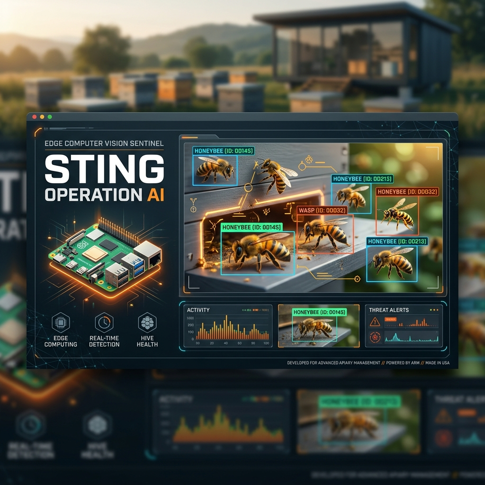
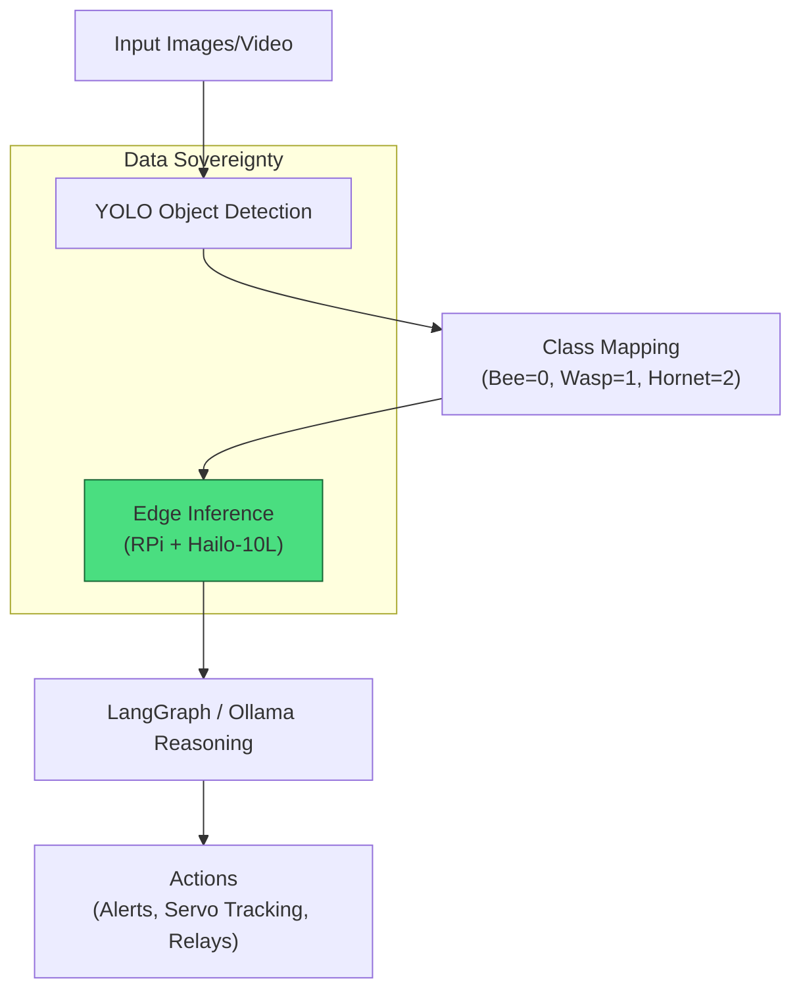

# Sting Operation AI: Bee and Wasp Detection



**Coastal Alpine Tech Limited**  
*Edge AI | Sovereign Systems | Practical Intelligence*

[](LICENSE)  
[](https://www.python.org/)  
[]()  
[]()  
[]()  
[](https://github.com/fivepanelhat/Sting-Operation-AI/actions)  
[](https://github.com/fivepanelhat/Sting-Operation-AI/actions/workflows/secops.yml)  
[]()  
[]()

Object detection system for protecting beehives by identifying honeybees versus invasive wasps using YOLO models and edge AI.

---

## The 5 Ws: Project Context

- **Who:** Built by Coastal Alpine Tech Limited for New Zealand apiarists and biosecurity efforts.
- **What:** A YOLO-based multi-class object detection pipeline focused on accurate differentiation between honeybees and invasive wasp species.
- **Where:** Engineered at HQ in New Plymouth, Taranaki. Designed for on-premise and edge deployment.
- **When:** Active development as of June 2026.
- **Why:** To deliver localized data sovereignty and real-time protection for beehives without reliance on cloud services.

---

## The Problem We Are Solving

The problem we are solving is the accurate real-time detection and differentiation of invasive wasps from honeybees in apiculture settings to enable automated protection of beehives while maintaining full data sovereignty on edge hardware.

Additional challenges addressed:
1. **Invasive Species Threat** — German wasps (*Vespula germanica*) and Yellow-legged hornets (*Vespa velutina*) threaten honeybee populations.
2. **Labeling and Training Accuracy** — Incorrect class mappings and limited datasets reduce model reliability, especially for wasp detection.
3. **Edge Deployment Constraints** — Traditional cloud-based vision systems introduce latency and privacy risks in remote apiaries.

---

## Key Features

- Multi-class YOLO object detection (Honeybee, German Wasp, Yellow-legged Hornet)
- Automated dataset cleanup and label correction tools
- Training and inference scripts with hardware acceleration support
- Roboflow dataset integration and validation
- Edge AI ready for Raspberry Pi 5 + Hailo-10L NPU
- Servo tracking and actuator integration potential

---

## Quick Start

### Prerequisites

- Python 3.10+
- Ultralytics YOLO
- Optional: Raspberry Pi 5 with Hailo-10L NPU for edge inference
- GPU recommended for training (CUDA support)

### Installation

```bash
git clone https://github.com/fivepanelhat/Sting-Operation-AI.git
cd Sting-Operation-AI

python -m venv venv
source venv/bin/activate  # Windows: venv\Scripts\activate

# Install shared core and dependencies
pip install git+https://github.com/fivepanelhat/coastal-alpine-core.git
pip install -r requirements.txt
pip install -r requirements-dev.txt
cp .env.example .env   # If applicable
```

### Setup & Validation

```bash
# Windows automated setup
setup_project.bat

# Manual cleanup and verification
python tools/tidy_and_fix.py
python tools/verify_setup.py
```

### Inference Example

```bash
python predict.py data/images/val/
```

---

## Architecture Overview



*For full details, see [docs/](./docs/) and Edge AI Hardware Guide.*

---

## Directory Structure

```bash
Sting-Operation-AI/
├── config/              # data.yaml and configurations
├── data/                # images, labels, raw annotations
├── models/              # base_weights and trained_models
├── tools/               # tidy_and_fix.py, verify_setup.py
├── predict.py
├── train.py
├── setup_project.bat
├── .github/workflows/   # CI/CD
└── README.md
```

---

## Technology Stack

**Hardware**  
- Raspberry Pi 5 + Hailo-10L NPU  
- Camera modules and potential servo/relay actuators

**Software**  
- **Detection:** Ultralytics YOLO  
- **Orchestration:** Local scripts with optional LangGraph / Ollama  
- **Dataset:** Roboflow integration  
- **Deployment:** Edge-ready with systemd/Docker support

---

## Real-World Examples and Implementation

- **Beehive Protection in New Zealand Apiaries**: Deployed at hive entrances to detect and trigger alerts or deterrents when invasive wasps approach, protecting local honeybee colonies.
- **Biosecurity Monitoring**: Used by regional councils or commercial beekeepers for early warning of Yellow-legged hornet incursions.
- **Research and Training**: Integrated into educational programs or pest management studies with custom model retraining.

**Implementation Notes:**
- Run `setup_project.bat` or manual verification tools to ensure correct class mappings.
- Train or fine-tune models using `train.py` with your expanded dataset.
- Deploy inference via `predict.py` on edge hardware; integrate with camera streams and actuators per the hardware guide in `docs/`.
- Combine with Gemma 4 via Ollama for higher-level reasoning (e.g., logging events or deciding response actions).
- Monitor performance with validation images and iteratively improve wasp detection accuracy.

---

## Performance & Benchmarks

* **Inference Latency:** ~12.5ms per frame processing YOLOv8 on Raspberry Pi 5 + Hailo-10L NPU.
* **Energy Consumption:** Peak Hailo-10L NPU draw is ~2.1W under continuous 30 FPS inference.
* **Model Accuracy:** German Wasp (*Vespula germanica*) mAP50 ~84.6%, Precision 84.2%, Recall 82.1%; Honeybee (*Apis mellifera*) mAP50 100%.

---

## Documentation

- [Edge AI & IoT Hardware Setup Guide](./docs/)
- [ARCHITECTURE.md](./ARCHITECTURE.md) — Detailed system design
- [CHANGELOG.md](./CHANGELOG.md) — Version history
- [DEVELOPMENT.md](./DEVELOPMENT.md) — Contribution guidelines


---

## License

This project is licensed under the Coastal Alpine Tech Limited License — see the [LICENSE](./LICENSE) file for details.

---

**Built with focus on data sovereignty and edge intelligence.**  
Questions or collaboration? Contact Coastal Alpine Tech Limited.

---

*Last updated: June 2026*
