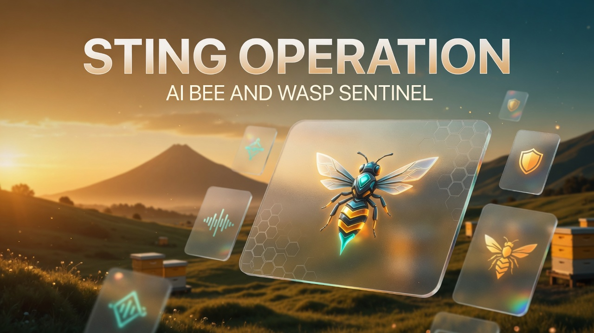
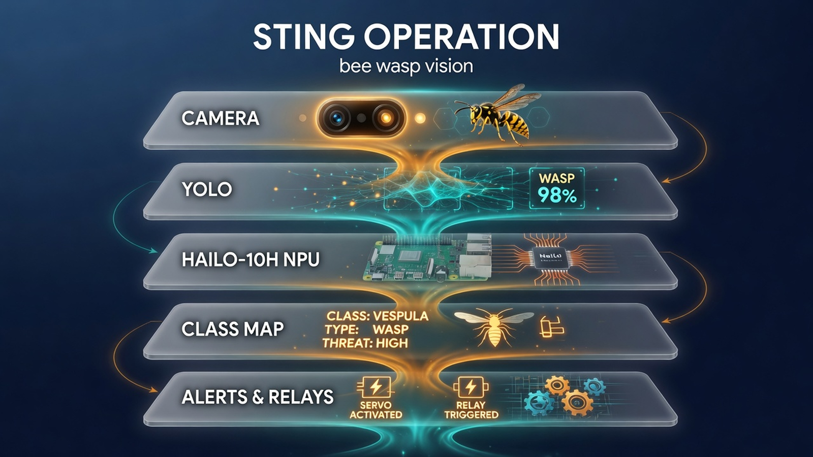
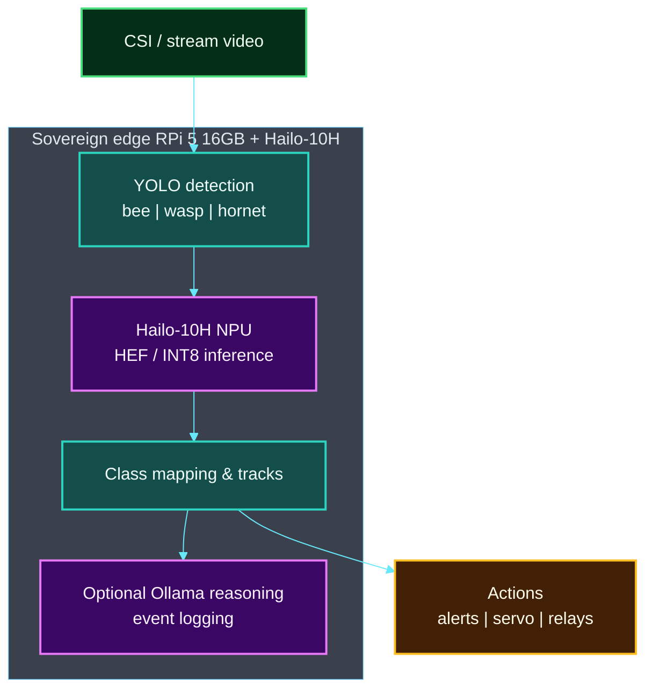

# Sting Operation AI: Bee and Wasp Detection

[](./COMPLIANCE.md)
[](./SECURITY.md)
[](./COMPLIANCE.md)


<!-- BEGIN CAT_CONGRUENCE_SNIPPET -->
## Coastal Alpine Tech portfolio

[](https://github.com/fivepanelhat/fivepanelhat)
[](https://github.com/fivepanelhat/fivepanelhat)
[](./.github/agent-fleet/AGENTS.md)
[](https://github.com/fivepanelhat/fivepanelhat)

**Part of the [Kiwi Edge AI Stack](https://github.com/fivepanelhat/fivepanelhat)** | Founder OS: [NZ-Start-Up](https://github.com/fivepanelhat/NZ-Start-Up) | Agent policy: [`.github/agent-fleet/`](./.github/agent-fleet/)

> Sovereign hybrid edge AI for NZ farms and founders - local-first + multi-model, Te Mana Raraunga aligned - collaborating with Venture Taranaki, startups.com investors and Kotahitanga Investment Fund (HITL + cultural advisory for formal approaches).

**Agents inform, draft, prepare, monitor, and remind. Humans advise, sign, file, send, and pay.** 
Anti-hallucination policy: [`.github/agent-fleet/anti-hallucination.md`](./.github/agent-fleet/anti-hallucination.md) | Congruence: [`CAT_CONGRUENCE.md`](./CAT_CONGRUENCE.md)
<!-- END CAT_CONGRUENCE_SNIPPET -->

<!-- BEGIN PRIVACY_SECURITY_GOVERNANCE -->
## Privacy · Security · Governance

Coastal Alpine Tech products treat operational and personal data as **taonga**. Defaults favour **local-first** operation, **purpose-limited** collection, and **Human-in-the-Loop** for high-stakes actions.

| Pillar | Commitment |
| :--- | :--- |
| **Privacy** | Local-first / offline-capable where practical; Privacy Act 2020 awareness; cloud and third-party AI only when **opt-in and labelled** |
| **Security** | No silent exfiltration of tenant or personal data; owner-controlled keys; SecOps / dependency hygiene on the fleet cadence |
| **Governance** | Agents **inform, draft, prepare**; humans **advise, sign, file, send, and pay**. Te Mana Raraunga spirit for Māori data sovereignty |

**Agents inform, draft, prepare, monitor, and remind. Humans advise, sign, file, send, and pay.**

Fleet policy: [fivepanelhat / Kiwi Edge AI Stack](https://github.com/fivepanelhat/fivepanelhat) · Product detail: [`COMPLIANCE.md`](./COMPLIANCE.md) · [`SECURITY.md`](./SECURITY.md) (where present) · [`CAT_CONGRUENCE.md`](./CAT_CONGRUENCE.md) (where present)
<!-- END PRIVACY_SECURITY_GOVERNANCE -->


<!-- BEGIN PROBLEMS_SOLUTIONS_ECONOMY -->
## Problems we are solving

**Sting-Operation-AI** is edge vision for apiculture biosecurity - wasp vs bee discrimination on-device.

1. **Invasive wasp pressure** - German wasps and related threats hit NZ honeybee operations hard.
2. **Cloud vision latency / privacy** - Apiaries need on-site inference, not a remote API round-trip.
3. **Label noise** - Weak datasets and class confusion destroy field trust.
4. **Sovereign biosecurity data** - Hive imagery and detections should stay under operator control.

## Solution we have built

| Built capability | What it does |
| :--- | :--- |
| **YOLO multi-class detection** | Honeybee / German wasp / hornet classes |
| **Dataset hygiene tools** | Cleanup and label correction paths |
| **Edge-ready training/inference** | RPi 5 + Hailo-10H target |
| **Stack fit** | Biosecurity sister to Byte Size Kai beachhead |

### Local (Taranaki) and national (Aotearoa) economic benefits

| Lever | Benefit |
| :--- | :--- |
| **Regional R&D HQ** | Product design and IP stay in New Plymouth / Taranaki - not only Auckland/offshore SaaS |
| **Primary-sector productivity** | On-farm and rural tools aim to cut waste, protect consents, and support export competitiveness |
| **Skilled employment pathways** | Edge install, field support, agritech ops, software, compliance, and cultural advisory roles as pilots scale |
| **Data sovereignty** | Te Mana Raraunga-aligned local custody keeps high-value operational data onshore |
| **HITL jobs quality** | Agents **inform / draft / prepare / monitor / remind**; humans **advise / sign / file / send / pay** - augment people, do not fake full autonomy |

**Stage honesty (pre-seed):** Impact today is founder R&D, near-term contractors, and EDA/partner leverage. Permanent multi-region payroll follows paid pilots and revenue - we do not invent headcount claims.
<!-- END PROBLEMS_SOLUTIONS_ECONOMY -->

[](./LICENSE)
[](https://www.python.org)
[](https://ultralytics.com)

[](https://github.com/fivepanelhat/Sting-Operation-AI)
[](https://github.com/fivepanelhat/Sting-Operation-AI)
[](https://github.com/fivepanelhat/Sting-Operation-AI)
[](https://github.com/fivepanelhat/Sting-Operation-AI)

[](https://anthropic.com)
[](https://gemini.google.com)
[](https://openai.com)
[](https://x.ai)

[](https://github.com/fivepanelhat/Sting-Operation-AI)
[](https://ollama.com)
[](https://github.com/fivepanelhat/Sting-Operation-AI)

[](https://github.com/fivepanelhat/Sting-Operation-AI/actions/workflows/ci-scan.yml)
[](https://github.com/fivepanelhat/Sting-Operation-AI/actions/workflows/secops.yml)
[](https://github.com/fivepanelhat/Sting-Operation-AI/actions/workflows/redteam.yml)
[](https://github.com/fivepanelhat/Sting-Operation-AI/security/dependabot)



**Coastal Alpine Tech Limited** pre-seed startup, New Plymouth, Taranaki, Aotearoa New Zealand.
*Edge AI | Sovereign Systems | Practical Intelligence*

Object detection system for protecting beehives by identifying honeybees versus invasive wasps using YOLO models and edge AI.

---

## The 5 Ws: Project Context

- **Who:** Built by Coastal Alpine Tech Limited for New Zealand apiarists and biosecurity efforts.
- **What:** A YOLO-based multi-class object detection pipeline focused on accurate differentiation between honeybees and invasive wasp species.
- **Where:** Engineered at HQ in New Plymouth, Taranaki. Designed for on-premise and edge deployment.
- **When:** Active development as of June 2026.
- **Why:** To deliver localized data sovereignty and real-time protection for beehives without reliance on cloud services.

---


---

## Key Features

- Multi-class YOLO object detection (Honeybee, German Wasp, Yellow-legged Hornet)
- Automated dataset cleanup and label correction tools
- Training and inference scripts with hardware acceleration support
- Roboflow dataset integration and validation
- Edge AI ready for Raspberry Pi 5 + Hailo-10H NPU
- Servo tracking and actuator integration potential

---

## Quick Start

### Prerequisites

- Python 3.10+
- Ultralytics YOLO
- Optional: Raspberry Pi 5 with Hailo-10H NPU for edge inference
- GPU recommended for training (CUDA support)

### Installation & Setup

We provide separate guides for system environment setup and installation for Windows and Linux users:

* **Prerequisites & System Setup Guide**: Read [setup.md](setup.md)
* **Installation Guide**: Read [installation.md](installation.md)

### Quick Start (Automated Setup)
The fastest way to install is running the cross-platform bootstrap script:

```bash
python bootstrap.py
```

ation-AI
python bootstrap.py
```

### Manual Installation

<details open>
<summary><strong> Linux / macOS (Bash)</strong></summary>

```bash
git clone https://github.com/fivepanelhat/Sting-Operation-AI.git
cd Sting-Operation-AI

python3 -m venv venv
source venv/bin/activate

# Install shared core and dependencies
pip install git+https://github.com/fivepanelhat/coastal-alpine-core.git
pip install -r requirements.txt
pip install -r requirements-dev.txt
cp .env.example .env # If applicable
```

</details>

<details>
<summary><strong> Windows (PowerShell)</strong></summary>

```powershell
git clone https://github.com/fivepanelhat/Sting-Operation-AI.git
cd Sting-Operation-AI

python -m venv venv
.\venv\Scripts\Activate.ps1

# Install shared core and dependencies
pip install git+https://github.com/fivepanelhat/coastal-alpine-core.git
pip install -r requirements.txt
pip install -r requirements-dev.txt
Copy-Item .env.example .env # If applicable
```

> **Note:** If you receive an execution policy error, run `Set-ExecutionPolicy -Scope CurrentUser RemoteSigned` first.

</details>

### Setup & Validation

```bash
# Windows automated setup
setup_project.bat

# Manual cleanup and verification
python tools/tidy_and_fix.py
python tools/verify_setup.py
```

### Inference Example

```bash
python predict.py data/images/val/
```

---

## Architecture Overview

> **Diagrams:** Architecture images and Mermaid maps describe the **target product architecture** for this pre-seed stack. They are engineering design maps not claims of large-scale commercial fleet deployment.

Sting Operation protects hives with **real-time bee vs wasp vision** on the edge. YOLO detection runs on **Hailo-10H**; higher-level decisions use local Ollama on **RPi 5 16GB** no cloud video upload.



### System map


```mermaid
%%{init: {
 "theme": "dark",
 "themeVariables": {
 "fontSize": "16px",
 "fontFamily": "Inter, ui-sans-serif, system-ui, sans-serif",
 "primaryColor": "#0ea5e9",
 "primaryTextColor": "#f8fafc",
 "primaryBorderColor": "#38bdf8",
 "lineColor": "#67e8f9",
 "secondaryColor": "#1e293b",
 "tertiaryColor": "#0f172a",
 "clusterBkg": "#0b1220cc",
 "clusterBorder": "#38bdf880",
 "titleColor": "#e2e8f0"
 },
 "flowchart": {
 "nodeSpacing": 40,
 "rankSpacing": 48,
 "padding": 20,
 "htmlLabels": true,
 "curve": "basis"
 }
}}%%
flowchart TB

 classDef sense fill:#052e16,stroke:#4ade80,stroke-width:2px,color:#f0fdf4
 classDef edge fill:#0c4a6e,stroke:#38bdf8,stroke-width:2px,color:#f0f9ff
 classDef core fill:#134e4a,stroke:#2dd4bf,stroke-width:2px,color:#f0fdfa
 classDef act fill:#422006,stroke:#fbbf24,stroke-width:2px,color:#fffbeb
 classDef store fill:#1e1b4b,stroke:#a5b4fc,stroke-width:2px,color:#eef2ff
 classDef ai fill:#3b0764,stroke:#e879f9,stroke-width:2px,color:#fdf4ff
 classDef app fill:#1e1b4b,stroke:#c4b5fd,stroke-width:2px,color:#eef2ff

 CAM["CSI / stream video"] --> YOLO["YOLO detection<br/>bee | wasp | hornet"]
 YOLO --> HEF["Hailo-10H NPU<br/>HEF / INT8 inference"]
 HEF --> MAP["Class mapping & tracks"]
 MAP --> LLM["Optional Ollama reasoning<br/>event logging"]
 MAP --> ACT["Actions<br/>alerts | servo | relays"]

 subgraph EDGE["Sovereign edge RPi 5 16GB + Hailo-10H"]
 YOLO
 HEF
 MAP
 LLM
 end

 class CAM sense
 class YOLO,MAP core
 class HEF,LLM ai
 class ACT act
```

 | Layer | Components | Role |
 | :--- | :--- | :--- |
 | **Vision** | YOLO multi-class | Bee / wasp / hornet |
 | **NPU** | Hailo-10H 40 TOPS | Real-time edge FPS |
 | **Reasoning** | Ollama optional | Event narrative / logs |
 | **Actuation** | Alerts | servo | relays | Hive protection loop |

*Full detail: [ARCHITECTURE.md](./ARCHITECTURE.md) | [docs/](./docs/)*

## Directory Structure

```bash
Sting-Operation-AI/
|-- config/ # data.yaml and configurations
|-- data/ # images, labels, raw annotations
|-- models/ # base_weights and trained_models
|-- tools/ # tidy_and_fix.py, verify_setup.py
|-- predict.py
|-- train.py
|-- setup_project.bat
|-- .github/workflows/ # CI/CD
-- README.md
```

---

## Technology Stack

### Hardware

- Raspberry Pi 5 + Hailo-10H NPU
- Camera modules and potential servo/relay actuators

### Software

- **Detection:** Ultralytics YOLO
- **Orchestration:** Local scripts with optional LangGraph / Ollama
- **Dataset:** Roboflow integration
- **Deployment:** Edge-ready with systemd/Docker support

---

## Real-World Examples and Implementation

- **Beehive Protection in New Zealand Apiaries**: Deployed at hive entrances to detect and trigger alerts or deterrents when invasive wasps approach, protecting local honeybee colonies.
- **Biosecurity Monitoring**: Used by regional councils or commercial beekeepers for early warning of Yellow-legged hornet incursions.
- **Research and Training**: Integrated into educational programs or pest management studies with custom model retraining.

### Implementation Notes

- Run `setup_project.bat` or manual verification tools to ensure correct class mappings.
- Train or fine-tune models using `train.py` with your expanded dataset.
- Deploy inference via `predict.py` on edge hardware; integrate with camera streams and actuators per the hardware guide in `docs/`.
- Combine with Gemma 4 via Ollama for higher-level reasoning (e.g., logging events or deciding response actions).
- Monitor performance with validation images and iteratively improve wasp detection accuracy.

---

## Performance & Benchmarks

- **Inference Latency:** ~12.5ms per frame processing YOLOv8 on Raspberry Pi 5 + Hailo-10H NPU.
- **Energy Consumption:** Peak Hailo-10H NPU draw is ~2.1W under continuous 30 FPS inference.
- **Model Accuracy:** German Wasp (*Vespula germanica*) mAP50 ~84.6%, Precision 84.2%, Recall 82.1%; Honeybee (*Apis mellifera*) mAP50 100%.

---

## Documentation

- [Edge AI & IoT Hardware Setup Guide](./docs/)
- [ARCHITECTURE.md](./ARCHITECTURE.md) Detailed system design
- [CHANGELOG.md](./CHANGELOG.md) Version history

---

## License

This project is licensed under the Coastal Alpine Tech Limited License see the [LICENSE](./LICENSE) file for details.

---

**Built with focus on data sovereignty and edge intelligence.**
Questions or collaboration? Contact Coastal Alpine Tech Limited.

---

Last updated: June 2026.
