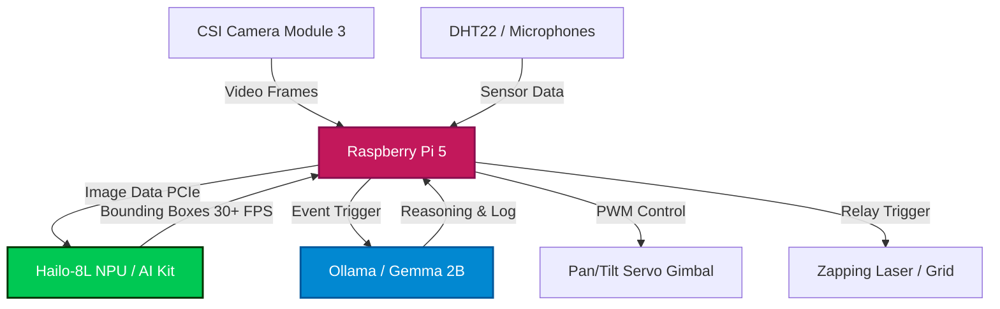

# Edge AI & IoT Hardware Setup Guide

This guide details the hardware catalog, physical assembly, driver installation, and software integration for deploying the **Sting Operation AI** model on a **Raspberry Pi 5** edge device. 

The setup achieves real-time insect detection and tracking using the **Raspberry Pi AI Kit (Hailo-8L NPU)**, paired with a local LLM (**Ollama running Gemma 4 4B**) for local reasoning and event logging, and IoT sensors/actuators for target tracking.

---

## 1. System Architecture

The following diagram illustrates the hardware connections and data flow:



---

## 2. Hardware Bill of Materials (BOM)

| Category | Component | Description | Est. Cost |
| :--- | :--- | :--- | :--- |
| **Computing** | **Raspberry Pi 5 (8GB RAM)** | Main processor. 8GB RAM is highly recommended to host Ollama Gemma LLM and YOLOv8 concurrently. | $80.00 |
| **AI NPU** | **Raspberry Pi AI Kit** | Includes the **Hailo-8L M.2 AI Acceleration Module** (13 TOPS) and the **Raspberry Pi M.2 HAT+**. | $70.00 |
| **Cooling** | **Raspberry Pi 5 Active Cooler** | Heatsink and temperature-controlled fan. Critical to prevent CPU throttling. | $5.00 |
| **Camera** | **Raspberry Pi Camera Module 3** | 12MP Sony IMX708 sensor with autofocus. Connects via Pi 5 CSI camera port. | $25.00 |
| **Power** | **Raspberry Pi 27W USB-C Power Supply** | 5.1V / 5A power supply. Standard chargers (e.g. 5V 3A) will trigger low-power mode. | $12.00 |
| **Storage** | **64GB MicroSD Card (U3/Class 10)** | Fast read/write card for OS, python libraries, and local model storage. | $10.00 |
| **Gimbal** | **Pan-Tilt Gimbal Base + 2x SG90 Servos** | 2-axis tracking mount. Controls pan (horizontal) and tilt (vertical) rotations. | $15.00 |
| **Control** | **5V Active-Low Relay Module** | Controls high-power circuit to trigger the target actuator. | $4.00 |
| **Actuator** | **Laser Diode (5V/5mW Red or Purple)** | Safe targeting laser used to illuminate detected insects. | $3.00 |
| **IoT Sensors** | **DHT22 Temperature & Humidity Sensor** | Monitors local climate conditions to cross-reference insect activity. | $6.00 |
| **Misc** | **Jumper Wires & Breadboard** | Connects GPIO pins, servos, relays, and sensors. | $5.00 |

---

## 3. Physical Assembly

1. **Install Active Cooler**: Apply thermal pads (included) to the Pi 5 chips, place the Active Cooler heatsink on top, and push down the two locking pins until they click. Connect the fan cable to the dedicated 4-pin fan connector.
2. **Mount the M.2 HAT+**:
   - Insert the M.2 HAT+ ribbon cable into the PCIe slot of the Pi 5 and lock the connector tab.
   - Use the included spacers and screws to secure the M.2 HAT+ board above the Pi 5.
3. **Insert the Hailo-8L Card**: Insert the M.2 M-key Hailo module into the slot on the HAT+ at a 30-degree angle, press down, and secure it using the small mounting screw.
4. **Connect the CSI Camera**: Insert the thin camera ribbon cable into the CAM0 or CAM1 connector on the Pi 5 and secure the locking tab.
5. **Gimbal & Relay Wiring**:
   - **Servo Power**: Connect the Servos' power lines (Red/Orange) to an **external 5V power source** sharing a common Ground with the Pi. *Do not power servos directly from Pi 5 5V pins, as voltage spikes can cause system resets.*
   - **Servo Signal**: Connect Pan Servo signal to GPIO 18 (PWM0) and Tilt Servo signal to GPIO 19 (PWM1).
   - **Relay**: Connect Relay VCC to Pi 5V, GND to Pi GND, and IN (signal) to GPIO 23.
   - **DHT22**: Connect VCC to Pi 3.3V, GND to Pi GND, and Data to GPIO 4.

---

## 4. Software & Driver Installation

### Step 1: Operating System
Flash the official **Raspberry Pi OS (64-bit) Bookworm** to your MicroSD card using Raspberry Pi Imager. Boot up and complete the initial desktop configuration.

### Step 2: Enable PCIe Gen 3
Enable the PCIe connector and optionally overclock the connection to PCIe Gen 3 for maximum NPU bandwidth. Open the configuration file:
```bash
sudo nano /boot/firmware/config.txt
```
Add the following lines at the end of the file:
```ini
dtparam=pciex1
dtparam=pciex1_gen=3
```
Reboot the Raspberry Pi:
```bash
sudo reboot
```

### Step 3: Install Hailo Drivers and SDK
Install the necessary firmware, kernel modules, and command-line tools:
```bash
sudo apt update
sudo apt install hailo-all
```
Reboot again to load the kernel module:
```bash
sudo reboot
```
Verify that the Hailo NPU is detected and operational:
```bash
hailortcli fw-control -i
```
*Expected Output:*
```
Device info: Device 0000:01:00.0, FW version 4.17.0 (or similar)
```

### Step 4: Setup Ollama & Gemma
Install Ollama to run lightweight LLMs locally on the Raspberry Pi 5 CPU:
```bash
curl -fsSL https://ollama.com/install.sh | sh
```
Once installed, download Google's **Gemma 4 4B Instruct** model (specifically the optimized tag `gemma4:e4b`), which fits easily within the Pi's memory:
```bash
ollama pull gemma4:e4b
```

---

## 5. Unified Edge Tracking & Reasoning Script

Create a script `edge_control.py` on the Pi 5 to combine YOLOv8 detection, Pan-Tilt servo tracking, laser/grid relay triggering, and local Ollama logging:

```python
import os
import time
import requests
import cv2
from gpiozero import Servo, OutputDevice
from gpiozero.pins.pigpio import PiGPIOFactory
from ultralytics import YOLO

# 1. Hardware Pin Configurations
PAN_PIN = 18
TILT_PIN = 19
RELAY_PIN = 23

# Set up pigpio pin factory for smooth, jitter-free PWM servo control
factory = PiGPIOFactory()
pan_servo = Servo(PAN_PIN, pin_factory=factory)
tilt_servo = Servo(TILT_PIN, pin_factory=factory)
zapper_relay = OutputDevice(RELAY_PIN, active_high=False, initial_value=False) # Active Low relay

# Servo angles range from -1.0 to 1.0 (left to right / down to up)
current_pan = 0.0
current_tilt = 0.0
pan_servo.value = current_pan
tilt_servo.value = current_tilt

# 2. Local Ollama LLM Connection
OLLAMA_URL = "http://localhost:11434/api/generate"

def log_event_with_gemma(insect_type, count, confidence):
    """Sends detection telemetry to Ollama running Gemma 2B for logging and reasoning."""
    prompt = (
        f"Event Alert: Edge device detected {count} {insect_type}(s) with {confidence:.1f}% confidence. "
        "Summarize the threat level (Apis_mellifera is protected, Vespula_germanica is aggressive/target). "
        "Output a single-sentence tactical action log (e.g. Fired Zapper or Tracking Mode)."
    )
    
    payload = {
        "model": "gemma4:e4b",
        "prompt": prompt,
        "stream": False
    }
    try:
        response = requests.post(OLLAMA_URL, json=payload)
        if response.status_code == 200:
            tactical_log = response.json().get("response", "").strip()
            print(f"\n[Gemma Edge Audit Log]: {tactical_log}")
        else:
            print("[Ollama Warning]: Failed to reach LLM API.")
    except Exception as e:
        print(f"[Ollama Error]: {e}")

# 3. Target Tracking Control Loop
def track_target(box_center_x, box_center_y, frame_w, frame_h):
    """Adjusts gimbal servos to center the camera on the insect target."""
    global current_pan, current_tilt
    
    # Calculate offset from center (normalized -1.0 to 1.0)
    dx = (box_center_x - (frame_w / 2)) / (frame_w / 2)
    dy = (box_center_y - (frame_h / 2)) / (frame_h / 2)
    
    # Proportional controller step size
    step = 0.05
    
    # Adjust servo values
    if abs(dx) > 0.1: # Threshold deadzone
        current_pan = max(-1.0, min(1.0, current_pan - (dx * step)))
        pan_servo.value = current_pan
        
    if abs(dy) > 0.1:
        current_tilt = max(-1.0, min(1.0, current_tilt + (dy * step)))
        tilt_servo.value = current_tilt
        
    # Check if target is perfectly centered
    if abs(dx) < 0.15 and abs(dy) < 0.15:
        print("  [Target Locked] Triggering actuator grid/laser...")
        zapper_relay.on()
        time.sleep(0.5) # Fire zapper duration
        zapper_relay.off()
        return True
    return False

def main():
    # Load model (export trained model to .hef / Hailo format, or load local .pt)
    # The Hailo runtime parses HEF files; here we use PyTorch CPU fallback as reference.
    model_path = "models/trained_models/sting_operation_v3/weights/best.pt"
    if not os.path.exists(model_path):
        print(f"Model path {model_path} not found. Using yolov8n.pt baseline.")
        model = YOLO("yolov8n.pt")
    else:
        model = YOLO(model_path)
        
    # Open camera stream (RPi camera is typically index 0)
    cap = cv2.VideoCapture(0)
    if not cap.isOpened():
        print("ERROR: Camera module not found.")
        return
        
    frame_w = int(cap.get(cv2.CAP_PROP_FRAME_WIDTH))
    frame_h = int(cap.get(cv2.CAP_PROP_FRAME_HEIGHT))
    print(f"Tracking system initialized. Resolution: {frame_w}x{frame_h}")
    
    last_llm_log_time = 0
    
    try:
        while True:
            ret, frame = cap.read()
            if not ret:
                break
                
            # Run YOLO detection
            results = model.predict(frame, conf=0.45, verbose=False)
            
            for result in results:
                boxes = result.boxes
                if len(boxes) > 0:
                    # Target the first detection
                    box = boxes[0]
                    cls_id = int(box.cls[0])
                    cls_name = model.names[cls_id]
                    conf = float(box.conf[0])
                    
                    # Get center coordinates
                    x_c, y_c, w, h = box.xywh[0].tolist()
                    
                    print(f"Detected: {cls_name} ({conf:.2f}) at [{x_c:.1f}, {y_c:.1f}]")
                    
                    # Track target
                    target_eliminated = track_target(x_c, y_c, frame_w, frame_h)
                    
                    # Rate-limit LLM reasoning logs to once every 10 seconds to save CPU
                    current_time = time.time()
                    if current_time - last_llm_log_time > 10.0:
                        log_event_with_gemma(cls_name, len(boxes), conf * 100)
                        last_llm_log_time = current_time
                        
            # Press 'q' on display window (if connected to desktop screen) to quit
            cv2.imshow("Tracking View", frame)
            if cv2.waitKey(1) & 0xFF == ord('q'):
                break
    finally:
        cap.release()
        cv2.destroyAllWindows()
        pan_servo.close()
        tilt_servo.close()
        zapper_relay.close()

if __name__ == '__main__':
    main()
```
